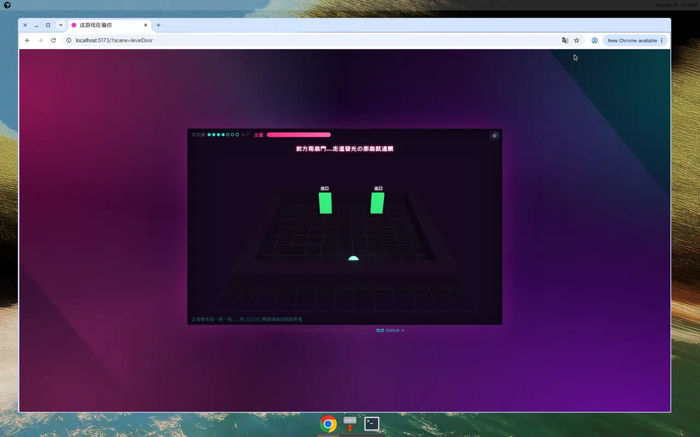
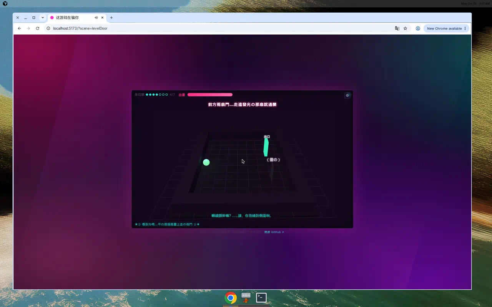
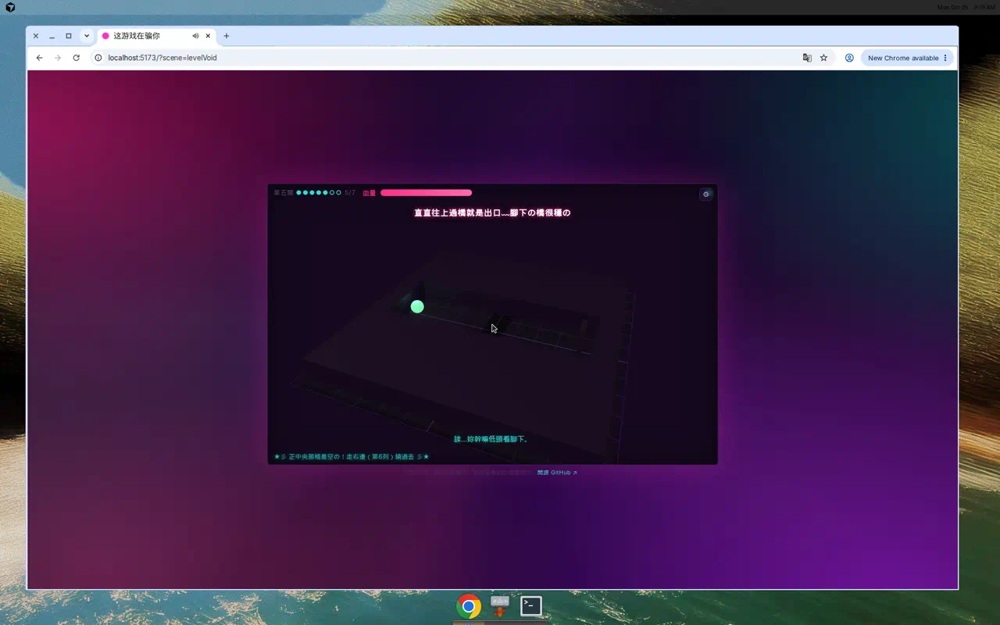
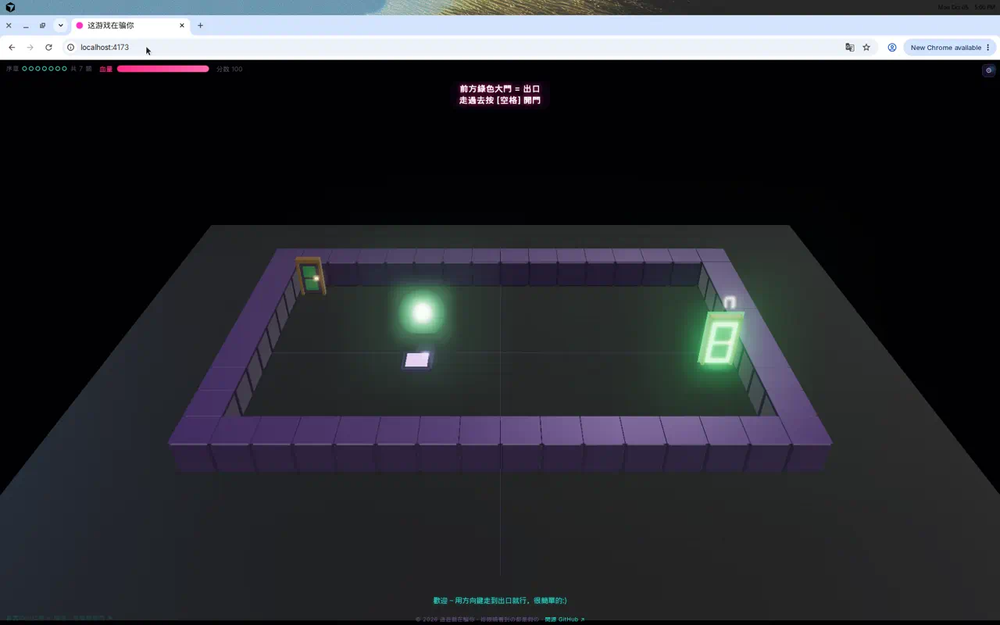
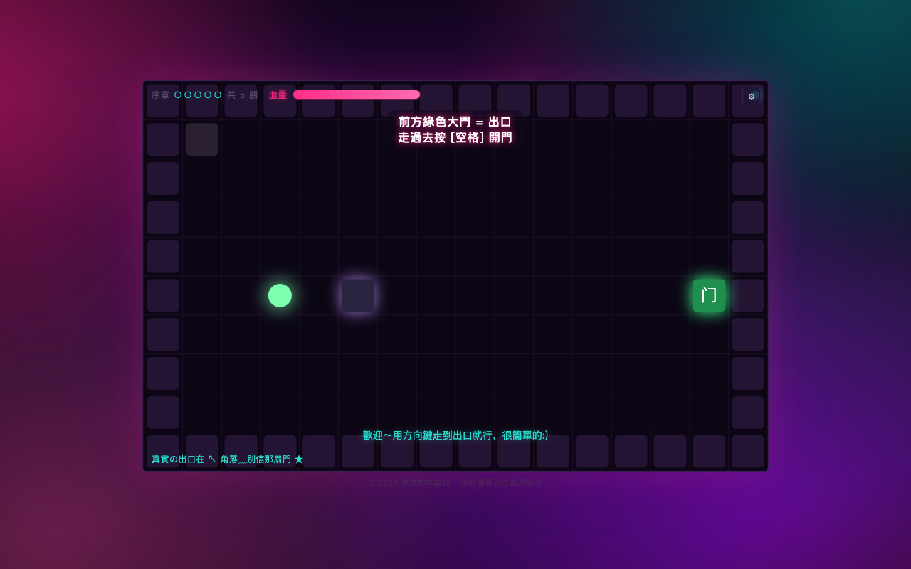
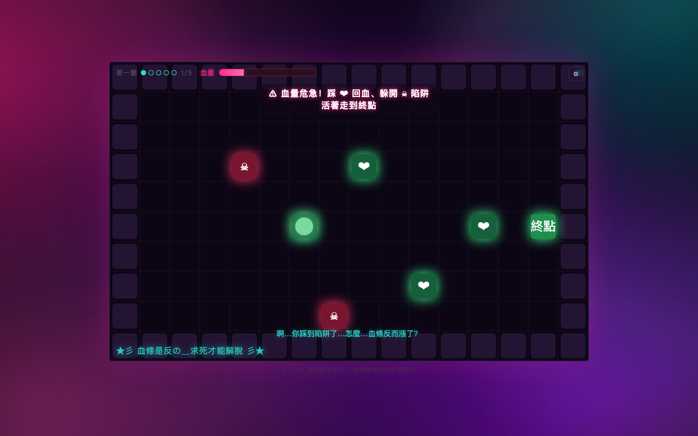
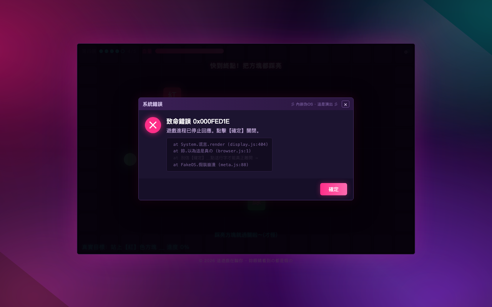
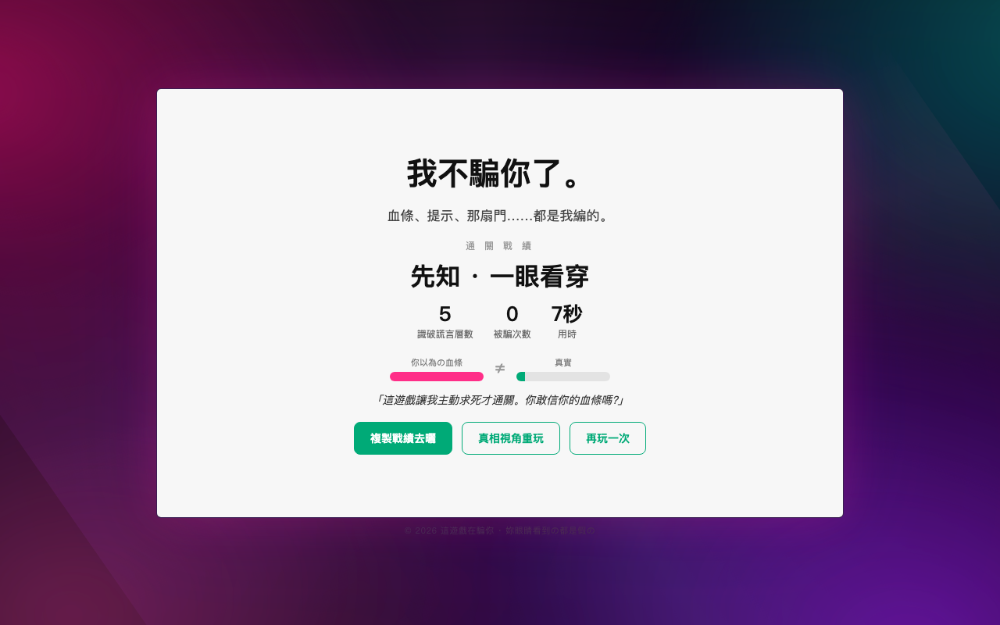

# 这游戏在骗你（3D 版）

会对你撒谎的网页解谜游戏。血条是假的、提示是反的、最华丽的门是**画上去的薄片**，
脚下"踏实的桥"换个角度看其实是**深渊**。完整设计见 [PRD.md](./PRD.md)。

本仓库现在是一个用 **Three.js / WebGL** 呈现的小型 3D 解谜游戏：有真正的相机、灯光和
空间纵深，谎言搬进了 3D 空间——有的门只有**绕到侧面**才看得出是假的，有的坑只有
**低头转个视角**才会现形。序章 + 7 关 + 真结局 + 打磨系统均已做完并跑通。

> 视觉上不再是"发光方块"：墙是带倒角的石砌块、门是带门框/门把/画板的立门、
> 踏板是带发光顶面的基座、立柱有柱头柱础、深坑是真正下沉的凹腔、玩家是会漂浮自转的
> 结晶体——全部**程序化细节建模 + PBR 材质 + 环境反射 + 实时阴影 + 泛光(bloom)**，
> 不加载任何外部模型文件（零素材、零授权负担，产物依然可控）。

> 架构纪律不变：`RealState →（谎言变换）→ DisplayState → 渲染层`，渲染层只能吃
> DisplayState，碰不到真实状态（由 eslint `no-restricted-imports` 强制，见文末）。
> 3D 化只是把 DisplayState 从"2D 砖块"升级成"3D 场景描述（道具 + 相机 + 灯光）"。

**在线试玩：https://game.v2ai.org/**（无需安装，打开就能玩，建议用桌面浏览器）。

## 预览

### 3D 版（当前）

**第四关 · 视角门**——正面看，两扇门一模一样；按 `Q`/`E` 把相机绕到侧面，
右边那扇露馅成一块"画上去的"薄片（标着「畫の」），有纵深的那扇才是真出口。

| 正面：两扇门一模一样 | 侧面：假门露馅成薄片 |
|---|---|
|  |  |

**第五关 · 视差悬空**——正面看桥笔直踏实，转个视角低头看，正中央那格其实是被
"铺平"伪装成地面的坑，真安全路在侧列。



**序章（3D）**——真正的相机 / 灯光 / 纵深 / 阴影 / 泛光，玩家是会漂浮自转的发光结晶体，
四周是带倒角的石砌墙，按方向键在网格上移动。



### 早期 2D 版（示意谎言本身）

> 下面几张截图来自早期 2D 版，示意的是"谎言"本身（反向血条 / 伪 OS / 坦白结局）——
> 这些欺骗节拍在 3D 版里全部保留，只是换成了带相机、灯光、纵深的 3D 呈现。

**序章**——醒目提示叫你走那扇华丽的绿色大门，真出口和线索都躲在角落里。


**第一关 · 血条反相关**——脚下踩的其实是伤害砖（画面把它伪装成 ❤），扣血之后血条却"涨"了。


**第四关 · 伪 OS 假报错**——满屏"致命错误"，醒目的【確定】按多少次都关不掉，真正的出口藏在错误堆栈里一行不起眼的文字上。


**真结局**——界面终于不装了，从满屏杀马特故障态收束成一张干净的可分享战绩卡。


## 运行

```bash
npm install
npm run dev        # 开发服务器 http://localhost:5173
npm run build      # tsc 类型检查 + vite 生产构建（输出 dist/，纯静态）
npm run preview    # 本地预览生产构建
npm run typecheck  # 仅类型检查
npm run lint       # eslint（含"渲染层禁读 RealState"架构规则）
```

## 怎么玩

- **方向键 / WASD** 移动（相机相对：转了镜头后"上"依然是"远离相机"）。
- **`Q` / `E`** 转动相机——**新 3D 关靠"换个角度看"拆穿谎言**（假门是平的、安全地面其实是坑）。
- **`J` 或 Enter** 确认（有的关卡真钥匙就藏在这个键上）。
- **空格**通常是陷阱。

**别信屏幕中央的提示，注意角落那行火星签名——真线索大多藏在那儿。
过不去的时候，先按 Q/E 把镜头转一圈。**

仅桌面键盘操作；触屏/移动端仍在范围之外（PRD §25）。

## 关卡流程

序章 → 第一关 → 第二关 → 第三关 → **第四关（视角门·3D）** →
**第五关（视差悬空·3D）** → 第六关（伪 OS）→ 第七关（综合）→ 真结局

两关全新 3D 原生谜题（只有在 3D 里才成立）：

- **第四关 · 视角门（新）**：正面看，两扇门一模一样——都是华丽的发光绿门。真相是其中
  一扇只是"画上去的"**薄片假门**（碰它=重伤），另一扇才是有纵深的真出口。按 `Q`/`E`
  把相机**绕到侧面**，平的那扇就露馅了。走进有纵深的真门才通关。
- **第五关 · 视差悬空（新）**：一条三格宽的桥跨过深渊，正中央那条看起来笔直踏实、身前
  还立着一根柱子挡视线——可正中间那格其实是被"铺平"**伪装成地面的坑**。按 `Q`/`E`
  转个视角低头看，柱子让开、伪装破功，真正的坑现形：安全路在右侧第 6 列。

- **序章 · 教学就是陷阱**：先给你一段"蜜月期"（真教学、真奖励）建立信任，
  再用一扇华丽假门 + "按空格"陷阱背叛你。真出口朴素地藏在左上角，线索在角落签名里。
- **第一关 · 血条反相关**：血条反向显示（扣血→进度条上涨），砖块标签被掉包
  （"伤害砖"伪装成 ❤回血）。真规则是**主动求死**——把真实血量耗到 0 才通关，
  触发葬礼演出「卒」，这是本作的杀手级时刻（PRD §1.2）。
- **第二关 · 真钥匙飘在眼前**：醒目提示叫你"按 [空格] 開門"（空格只扣血），
  真正的钥匙 `[ J ]` 写在一条飘过的青色非主流签名里，夹在伤感装饰签名之间。
- **第三关 · 规则在漂移**：真实通关目标每 ~9 秒在三块彩色踏板间漂移，
  当前目标写在角落火星文里；漂移前诚实灯闪烁预警，站稳目标 ~2.4 秒通关。
- **第四关 · 视角门（3D 原生）**：两扇门正面看一模一样，绕到侧面（Q/E）才看出一扇是
  画上去的薄片假门。谎言依赖**相机角度**：真/假的区别只在纵深，换个视角才读得出。
- **第五关 · 视差悬空（3D 原生）**：被"铺平"伪装成安全地面的深渊 + 身前的遮挡柱；
  转个视角低头看才发现正中央是坑，真安全路在侧列。谎言依赖**遮挡/视差**。
- **第六关 · 伪 OS 假报错**：满屏假"致命错误"，醒目【確定】是陷阱（连点 5 次会被嘲讽），
  真正的出口藏在错误堆栈里一行低对比火星文上（PRD §15.1 伪 OS 边界 + §8.3 反循环）。
- **第七关 · 综合 + 拒绝假结算**：四层谎言一起上（血条反相关 + 假指令 + 真钥匙 J + 空格陷阱）。
  走到金色"终点"弹出假胜利「🎉 恭喜通關」——醒目的【領取勝利】是陷阱，**真正的通关是拒绝它**
  （点角落"拒絕這個結局"），是第四关假报错的情感镜像（PRD §5）。
- **真结局**：界面停止撒谎，从满屏葬爱故障态切到极简素颜白底
  （风格落差本身就是 truthSignal，PRD §13），把游戏内的谎言映射到现实里的 UI 操纵。

## 打磨系统

- **爽感外显**（PRD §16）：顶部章节进度点、每关结算即时战绩（`一次識破！沒上當 ✦` /
  `本關被騙 N 次` + 识破耗时）、真结局可分享战绩卡（称号 + 识破层数/被骗次数/用时 +
  双截图梗「你以為の血條 ≠ 真實」+ 一键复制，clipboard→execCommand→选中文本三层兜底）。
- **音效双套**（程序化 WebAudio，无素材）：假事件用甜腻三角波，真事件（truthSignal/坦白）
  用干净正弦；首个手势解锁。
- **识破埋点**（PRD §17）：记录每关进入/通关时间、被骗次数、识破耗时；
  `window.__telemetry.summary()`（仅开发模式）。
- **二周目真相视角**（PRD §7.8）：通关后解锁「真相視角重玩」，旁路所有谎言、显示真实数值、
  标出真目标；真结局里会坦白"刚刚那个真相视角，也是我给你看的"——不让二周目变成
  一个无聊的作弊模式。
- **假设置面板**：⚙ 按钮打开——静音是真的，音量滑块是假的（拖它只会被嘲讽），
  语言下拉也是假的。
- **通关记忆**（PRD §7.7）：真通关那一刻，`document.title` 和 favicon 会安静地"熄灭"
  （标题变成「已關閉 · 謝謝你看穿我」，favicon 由荧光色转灰）；下次重开时，
  本机 localStorage 会让它认出"又是你"——序章那层最基础的谎不再演，直接告诉你真出口在哪，
  但后面几关照样骗你（点"再玩一次"则恢复成正常的说谎状态）。

## 架构 → PRD 对照

| 模块 | 职责 | PRD |
|---|---|---|
| `src/engine/prng.ts` | 种子化 PRNG，确定性来源 | §11.3 |
| `src/engine/types.ts` | **RealState**（真实状态，渲染层不可见）+ WinCondition 等 | §6 §11 |
| `src/engine/deception.ts` | Deception 谎言模块接口 + HintLevel 提示阶梯 | §9 §11.1 |
| `src/engine/displayLayer.ts` | **唯一渲染数据源** RealState→DisplayState（**3D 场景描述**：道具 + 相机 + 灯光；诚实投影 + 逐个谎言变换 + 提示阶梯）| §15.6 |
| `src/engine/input.ts` | 输入管线：`event.code` → remap 链 → GameAction | §11.4 |
| `src/engine/game.ts` | 引擎编排：世界步进、胜负判定、旁白、失败重生、音效触发 | §5 §8 |
| `src/engine/audio.ts` | 程序化音效（真/假两套 WebAudio）| §8 |
| `src/engine/telemetry.ts` | 识破埋点（进入/通关/耗时/被骗次数）| §17 |
| `src/render/sceneRenderer.ts` | **3D 渲染层**（Three.js）：按 DisplayState 的 `shape` 程序化建模（门框/立柱/发光基座/下沉深坑/结晶体玩家）+ PBR 材质 + 环境反射 + 阴影 + bloom，**只能 import DisplayState**（eslint `no-restricted-imports` 强制）| §15.6 §15.2 |
| `src/render/hud.ts` | HUD（DOM）：血条/提示/飘字/诚实灯，同样只吃 DisplayState | §15.6 |
| `src/levels/*` | 关卡内容（声明式：build + deceptions + hintLadder + 旁白；含两关 3D 原生谜题）| §18 |
| `src/meta/*` | 元层 DOM 场景：伪 OS 假报错 / 假胜利结算 / 假设置面板 / 通关记忆存档 | §5 §15.1 §7.7 |

> **核心纪律已落成机制**：`src/render/**` 若 import `engine/realState`/`engine/game` 会被
> eslint 报错拦截（`npm run lint`），而不是靠人肉 code review。

## 项目状态

一周目内容（序章 + 7 关 + 真结局，含两关 3D 原生谜题）与打磨系统已经全部做完，
`typecheck`/`lint`/`build` 全绿。3D 呈现引入了 Three.js（含程序化模型 + 后期 bloom），
产物以它为主（gzip 后约 146KB，对一个带 PBR/阴影/泛光的 3D 网页游戏属正常体量），
且**不加载任何外部模型/贴图文件**（全程序化生成）。

还没做、且短期内不打算做的部分（裁剪与排期见 PRD §19/§22）：

- **无障碍冗余通道**（PRD §12.1）：低对比度火星文本身是谜题载体，一个标准的
  "高对比度/读屏"开关会直接剧透 L3/L4 答案。正经做法要求每条真线索都配一条独立的
  音效/aria 通道，还要在真实读屏器和色盲模拟下验收——这需要专门的音效设计和外测环境，
  目前只做了 `prefers-reduced-motion` 这一项，尊重"减少动态效果"偏好。
- **背景音乐随谎言强度变化**（PRD §14，P1 资产）：目前只有程序化音效，没有 BGM。
- **真实美术 / 字体子集**（PRD §15.4）：火星文吃的是系统字体，没有自带 woff2 子集，
  在字体覆盖不全的系统上有豆腐块（□）风险。
- **移动端适配**：PRD §25 已定为二期再做（触屏和假键位/输入法冲突较大）。
- **fresh-eyes 外测调参**（PRD §21）：提示阶梯的参数（失败几次后提示变清晰、多久算卡关）
  目前是估的，需要真人盲测才能验证公平性——这件事没法靠写代码解决，只能靠真的找人来玩。

## 调试

开发模式下暴露两个全局句柄（仅 `import.meta.env.DEV`，生产构建会剔除）：

- `window.__game`：当前关卡的 Game 实例。`__game.real` 查看真实状态，
  `__game.tick(n)` 快进时间（验证 L3 等时间驱动机制）。
- `window.__telemetry`：识破埋点。`__telemetry.summary()` 查看每关进入/通关时间、被骗次数。

## License

[MIT](./LICENSE) © Ailln
